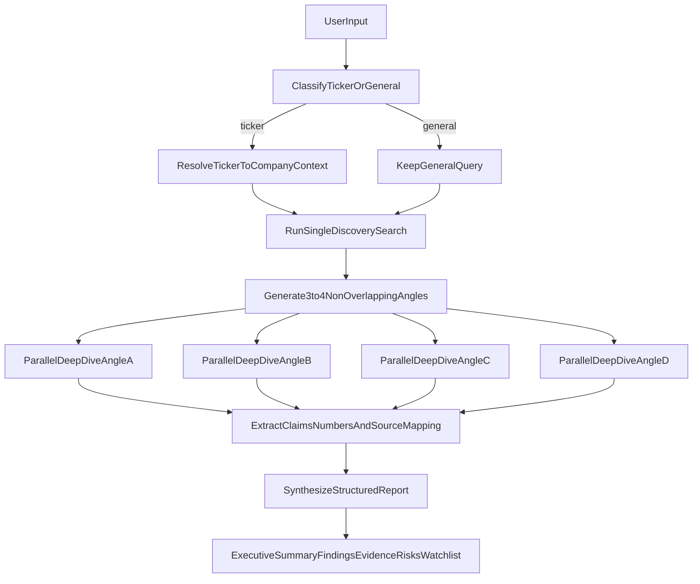

# High-Level Research Pipeline Plan

## Assumptions
- Workspace is treated as greenfield (no existing code to integrate with yet).
- Implementation target is Python.
- Search provider starts with DuckDuckGo for discovery and web page fetch for deep dives.

## Desired End-to-End Flow

## Implementation Plan

### 1) Query understanding and ticker enrichment
- Add a classifier that decides `ticker` vs `general_query` with confidence and fallback rules.
- For ticker input, resolve canonical company name + context tags (sector, business themes, aliases), e.g. `NVDA -> NVIDIA, semiconductors, GPUs, AI`.
- Output a normalized research intent object used by all downstream steps.

Planned files:
- [d:/Python/AI Agent Deep Researcher/src/research/query_understanding.py](d:/Python/AI%20Agent%20Deep%20Researcher/src/research/query_understanding.py)
- [d:/Python/AI Agent Deep Researcher/src/research/models.py](d:/Python/AI%20Agent%20Deep%20Researcher/src/research/models.py)

### 2) Initial discovery search (single DDG run)
- Run exactly one DuckDuckGo discovery search on normalized query intent.
- Capture top results with `title`, `url`, `snippet`, `rank`, `retrieval_time`.
- Keep provider abstraction so search backend can be swapped later.

Planned files:
- [d:/Python/AI Agent Deep Researcher/src/research/search/ddg_client.py](d:/Python/AI%20Agent%20Deep%20Researcher/src/research/search/ddg_client.py)
- [d:/Python/AI Agent Deep Researcher/src/research/search/discovery.py](d:/Python/AI%20Agent%20Deep%20Researcher/src/research/search/discovery.py)

### 3) Angle generation (3-4 non-overlapping tracks)
- Generate 3-4 distinct research angles from discovery snippets/results.
- Enforce non-overlap with a similarity threshold and dedupe pass.
- Include rationale and keyword set per angle to guide deep dives.

Planned files:
- [d:/Python/AI Agent Deep Researcher/src/research/angles.py](d:/Python/AI%20Agent%20Deep%20Researcher/src/research/angles.py)
- [d:/Python/AI Agent Deep Researcher/src/research/prompts/angle_generation.md](d:/Python/AI%20Agent%20Deep%20Researcher/src/research/prompts/angle_generation.md)

### 4) Parallel deep dives per angle
- For each angle, gather candidate sources (`title`, `url`, `snippet`) and fetch page content where possible.
- Use concurrency with per-source timeout, retry budget, and fetch-failure recording.
- Store raw evidence packets per angle for traceability.

Planned files:
- [d:/Python/AI Agent Deep Researcher/src/research/deep_dive.py](d:/Python/AI%20Agent%20Deep%20Researcher/src/research/deep_dive.py)
- [d:/Python/AI Agent Deep Researcher/src/research/fetch/web_fetcher.py](d:/Python/AI%20Agent%20Deep%20Researcher/src/research/fetch/web_fetcher.py)

### 5) Claim extraction and evidence mapping
- Extract key facts, numbers, and claims from fetched content.
- Require claim-level attribution: each claim must reference one or more source IDs and evidence snippets.
- Track conflicts when sources disagree on key numeric or directional statements.

Planned files:
- [d:/Python/AI Agent Deep Researcher/src/research/extraction.py](d:/Python/AI%20Agent%20Deep%20Researcher/src/research/extraction.py)
- [d:/Python/AI Agent Deep Researcher/src/research/citations.py](d:/Python/AI%20Agent%20Deep%20Researcher/src/research/citations.py)
- [d:/Python/AI Agent Deep Researcher/src/research/models.py](d:/Python/AI%20Agent%20Deep%20Researcher/src/research/models.py)

### 6) Synthesis into a structured report
- Produce one detailed report with these sections:
  - Executive summary
  - Key findings by angle
  - Evidence bullets with citations (URL + source title)
  - Risks/uncertainties + conflicting info
  - What to watch next
- Ensure every non-trivial claim is backed by at least one citation.

Planned files:
- [d:/Python/AI Agent Deep Researcher/src/research/synthesis.py](d:/Python/AI%20Agent%20Deep%20Researcher/src/research/synthesis.py)
- [d:/Python/AI Agent Deep Researcher/src/research/report_renderer.py](d:/Python/AI%20Agent%20Deep%20Researcher/src/research/report_renderer.py)
- [d:/Python/AI Agent Deep Researcher/src/research/prompts/synthesis.md](d:/Python/AI%20Agent%20Deep%20Researcher/src/research/prompts/synthesis.md)

### 7) Constraints and quality bars
- Add quality checks before final output:
  - Minimum source diversity across angles.
  - Freshness check (flag stale sources).
  - Citation coverage threshold for findings.
  - Conflict disclosure required when discrepancies detected.
- If bars are not met, return a partial-report warning with explicit gaps.

Planned files:
- [d:/Python/AI Agent Deep Researcher/src/research/quality.py](d:/Python/AI%20Agent%20Deep%20Researcher/src/research/quality.py)
- [d:/Python/AI Agent Deep Researcher/src/research/pipeline.py](d:/Python/AI%20Agent%20Deep%20Researcher/src/research/pipeline.py)

### 8) Validation and tests
- Add unit tests for classifier, angle dedupe, and citation mapping.
- Add integration test for full pipeline on one ticker and one general query.
- Validate output shape and citation presence in all required sections.

Planned files:
- [d:/Python/AI Agent Deep Researcher/tests/test_query_understanding.py](d:/Python/AI%20Agent%20Deep%20Researcher/tests/test_query_understanding.py)
- [d:/Python/AI Agent Deep Researcher/tests/test_angles.py](d:/Python/AI%20Agent%20Deep%20Researcher/tests/test_angles.py)
- [d:/Python/AI Agent Deep Researcher/tests/test_pipeline_integration.py](d:/Python/AI%20Agent%20Deep%20Researcher/tests/test_pipeline_integration.py)

## Output Contract (target)
- Final report object includes:
  - `executive_summary`
  - `sections[]` (one per angle, with findings)
  - `evidence_bullets[]` (`claim`, `source_title`, `url`, `snippet`)
  - `risks_uncertainties[]`
  - `conflicts[]`
  - `what_to_watch_next[]`
  - `quality_checks` (pass/fail + reasons)
